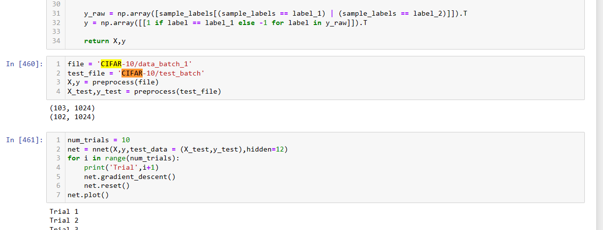

# Convexifying-Neural-Networks
ECE273 Final Project

## Introduction
This was my final project from the Convex Optimization Graduate Course with Professor Piya Pal at UCSD, written in the Spring of 2022.  
It replicates some of the results found in Pilanci 2020 and Wang 2022, both of which demonstrate that the optima found from training a two layer neural network with ReLU activation can be likewise reached using convex regularization methods. This result is generalizable to non-convex problems.

The CIFAR-10 image dataset was used to train the neural network. This can be downloaded from this website: https://www.cs.toronto.edu/~kriz/cifar.html. 

## Running the Code
Run the Jupyter Notebook file and put CIFAR data batches under directory name 'CIFAR-10/..'  
You can change pathname and batch used for training and testing the neural net by changing variables 'file' and 'test_file', shown below:  
  

